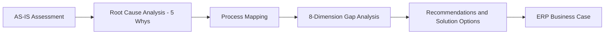
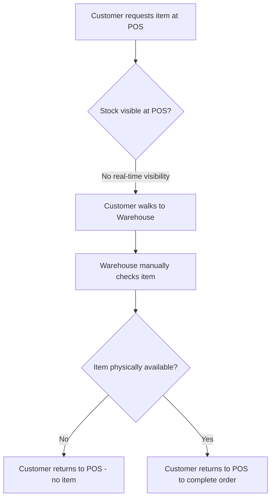
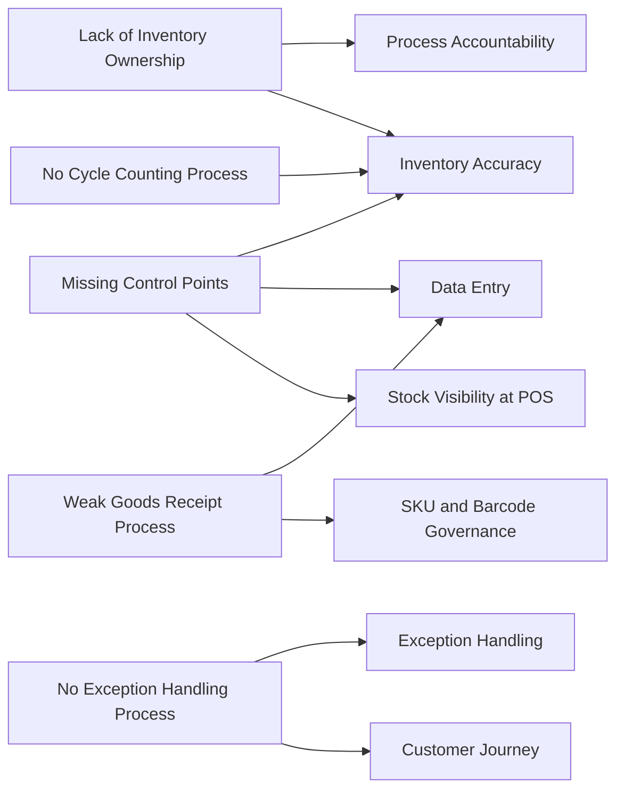
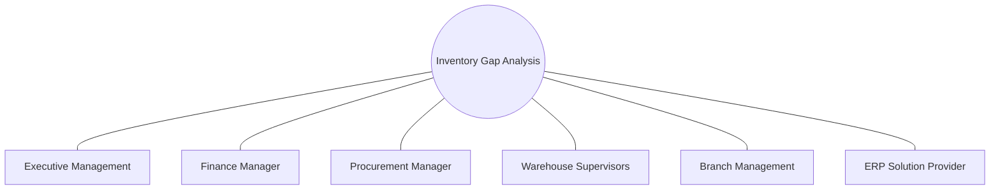

# Inventory Gap Analysis & ERP Readiness

---

## Overview

An enterprise-wide diagnostic engagement to assess inventory accuracy and operational readiness across a seven-branch retail and wholesale distribution business, undertaken to establish the evidence base for an ERP implementation decision.

---

## Business Context

The organization operated across seven branches — three wholesale branches, two supermarkets, and two mini-markets — within the food, beverage, and consumer goods sector. The business managed more than 10,000 active SKUs across a mixed perishable and non-perishable inventory profile. Prior to any ERP investment decision, the organization required a structured, evidence-based understanding of how accurate its inventory records actually were, and why.

---

## Business Problem

Inventory accuracy and operational inefficiencies across the seven branches had never been formally assessed. Discrepancies between system-recorded stock and physical stock were a known operational reality, but no structured diagnostic existed to quantify the scale of the problem, identify its causes, or provide a defensible basis for investment in ERP.

---

## Objectives

- Analyze inventory accuracy across all seven branches.
- Identify the operational inefficiencies contributing to inventory unreliability.
- Establish the business case and readiness assessment required to justify ERP implementation.

---

## Project Scope

- 7 branches: 3 Wholesale, 2 Supermarkets, 2 Mini-Markets.
- 10,000+ active SKUs.
- Inventory gap analysis across all branches.
- AS-IS operational assessment.
- Root cause analysis.
- Process mapping.
- ERP business case development.

---

## My Role

**Title:** Business Systems Coordinator
**Company:** Mohd. Saeed Balbid Company
**Duration:** Sep 2021 – Aug 2023

Responsible for supporting ERP readiness by analyzing business processes, documenting operational workflows, validating master data, conducting gap analysis, and preparing the organization for ERP implementation across all seven branches.

---

## Business Analysis Approach

### AS-IS Assessment
Documented existing inventory and operational workflows as they actually functioned across the seven branches, establishing the baseline against which gaps would be measured.

### Root Cause Analysis (5 Whys)
Applied the 5 Whys technique to move past surface-level symptoms of inventory inaccuracy and identify the underlying operational drivers, rather than treating discrepancies as isolated incidents.

### Process Mapping
Mapped operational workflows to identify the specific points where inventory processes broke down — where physical execution diverged from what the system recorded.

### Data Validation
Used Microsoft Excel for inventory variance analysis and data validation, and pulled stock movement and inventory data directly from ERP inventory reports and standard system reporting modules.

---

## Findings

### Gap Analysis — 8-Dimension Framework

Each dimension was assessed against a consistent structure: what was evaluated, the gap identified, its business impact, and the improvement direction it pointed toward. This is the analytical trail that fed directly into the ERP business case.

**1. Inventory Accuracy**
- *Assessed:* System-recorded inventory against physical stock across all seven branches.
- *Gap identified:* A 25–35% variance between system and physical stock.
- *Business impact:* Unreliable stock data undermined order fulfillment, financial reporting, and purchasing decisions across the business.
- *Improvement direction:* Mandatory system control points at issue, and introduction of a cycle counting process to replace annual-only physical counts.

**2. Stock Visibility at POS**
- *Assessed:* Whether point-of-sale staff had real-time visibility into warehouse stock levels before committing an order.
- *Gap identified:* No real-time warehouse stock visibility at POS — staff could not confirm item availability before requesting it for a customer.
- *Business impact:* Orders were drafted against stock that frequently wasn't physically available, directly driving the downstream customer journey problem below.
- *Improvement direction:* Real-time stock query integration between POS and warehouse systems prior to order confirmation.

**3. Data Entry**
- *Assessed:* Manual data entry dependency across operational touchpoints, including goods receipt.
- *Gap identified:* Manual entry existed across multiple processes — POS transactions, stock issuance, inter-branch transfers, shipping and delivery, and goods receipt (where PO matching was not enforced).
- *Business impact:* High error rate, slow processing, and inconsistent data across processes that fed into the same inventory figures.
- *Improvement direction:* Barcode/PDA scanning adoption at key touchpoints, with ERP-enforced entry and mandatory PO matching at receipt.

**4. Process Accountability**
- *Assessed:* Whether inventory accuracy had a defined owner at branch level.
- *Gap identified:* No single person was formally accountable for inventory discrepancies at each branch — ownership was not defined in the organizational structure.
- *Business impact:* Discrepancies persisted without a clear corrective-action driver; no one was positioned to be held accountable for closing the gap.
- *Improvement direction:* Formal definition of inventory ownership per branch.

**5. Customer Journey**
- *Assessed:* The physical customer flow during a wholesale transaction, from order request to invoice.
- *Gap identified:* A 3-step physical loop (POS → Warehouse → POS), directly observed and documented during this engagement. This pattern applied mainly to wholesale branches.
- *Business impact:* Slow, unprofessional transaction experience and elevated risk of customer abandonment, driven directly by the lack of stock visibility at POS.
- *Improvement direction:* Digital order confirmation eliminating the return trip to POS.

**6. Exception Handling**
- *Assessed:* The process followed when a requested item was unavailable.
- *Gap identified:* No documented escalation or decision-making process existed for exceptions.
- *Business impact:* Inconsistent resolution of the same problem depending on which staff member handled it, with no standard customer-facing response.
- *Improvement direction:* Documented exception-handling procedure, including escalation and backorder/substitute options.

**7. SKU & Barcode Governance**
- *Assessed:* The quality and standardization of SKU and barcode data across the product catalog.
- *Gap identified:* Two concurrent issues. First, multi-origin SKU duplication — the same product was registered as separate SKUs when sourced from different suppliers. Second, barcode governance — duplicate barcodes and products without assigned barcodes, rooted in barcode usage never having been adopted as a primary operational standard.
- *Business impact:* SKU duplication produced miscounts and confusion during picking, since the same physical product could appear under multiple system identities. The barcode gap independently caused incorrect picks and prevented scan-based control at receiving or issuance. Together, the two issues compounded inventory unreliability rather than one masking the other.
- *Improvement direction:* Normalize SKUs by treating supplier origin as a product attribute rather than a separate SKU, combined with a formal barcode governance standard mandating barcode assignment to support PDA/barcode scanning adoption at receiving and dispatch.

**8. Purchasing Intelligence**
- *Assessed:* The basis on which procurement made purchasing decisions.
- *Gap identified:* Purchasing was based on experience and estimation, with no inventory data, demand analysis, or consumption analysis used in planning.
- *Business impact:* Simultaneous overstock on some SKUs and stockouts on others, driven by decisions made without a data feed.
- *Improvement direction:* Data-driven reorder points fed by live inventory and consumption data.

### Root Cause Synthesis

The eight dimensions above surfaced five cross-cutting root causes — structural issues that each affected multiple dimensions simultaneously rather than being isolated to one area:

1. **Lack of Inventory Ownership** — underlies Process Accountability and reinforces the persistence of the Inventory Accuracy gap.
2. **Missing Control Points** — underlies Inventory Accuracy, Data Entry, and Stock Visibility at POS.
3. **No Cycle Counting Process** — underlies Inventory Accuracy.
4. **No Exception Handling Process** — underlies Exception Handling and the downstream Customer Journey impact.
5. **Weak Goods Receipt Process** — underlies Data Entry and SKU/Barcode Governance.

This synthesis — showing how five structural causes explain gaps across eight separate operational dimensions — is what gave the resulting ERP business case its analytical weight: the recommendation wasn't "fix eight separate problems," it was "resolve five structural causes to close eight operational gaps."

---

## Stakeholders

- Executive Management
- Finance Manager
- Procurement Manager
- Warehouse Supervisors
- Branch Management
- ERP Solution Provider

---

## Recommendations

### ERP Business Case
The consolidated findings — quantified variance, mapped process breakdowns, and five identified root causes — were translated into a formal ERP business case, giving the organization a defensible, evidence-based rationale for ERP investment rather than a general statement that "systems needed improvement."

### Process Improvement Recommendations
The analysis went beyond identifying root causes to evaluate potential solutions and future-state improvements for each. Recommendations included: defining formal inventory ownership per branch; introducing mandatory system control points at issue; establishing a cycle counting process; and documenting an exception handling procedure.

For the weak goods receipt process specifically, the evaluation assessed multiple corrective options rather than a single fix:
- **PDA / mobile Android barcode scanning devices** at receiving, to replace manual entry with system-validated scans.
- **ERP-based goods receipt with mandatory purchase order (PO) matching**, closing the gap that allowed goods to be received without system validation.
- **Other ERP best practices to strengthen receiving controls**, evaluated alongside the above to determine the most operationally feasible path forward.

This solution evaluation — not just root cause identification — is what gave the resulting ERP business case practical, implementable substance rather than a diagnostic-only conclusion.

---

## Business Outcomes

- Analyzed operations across all seven branches.
- Assessed more than 10,000 SKUs.
- Identified a 25–35% inventory variance.
- Identified five major operational root causes, each with a defined corrective direction.
- Produced an 8-dimension gap analysis used as a direct input into the subsequent ERP implementation project.
- Established the operational foundation and business case that supported the organization's decision to proceed with ERP implementation.

---

## Visual Documentation

*Diagrams below reflect only findings and structure documented and confirmed in this dossier's Evidence Mapping. No workflow, rule, or relationship shown here is invented.*

### Business Process Flow — Diagnostic Methodology

### AS-IS Process Diagram — Wholesale Customer Journey

Reflects the confirmed 3-step physical loop, specific to wholesale branches.

### Root Cause → Dimension Relationship

Visualizes the confirmed Root Cause Synthesis — five structural causes explaining gaps across eight dimensions.

### Stakeholder Map

### Before vs. Improvement Direction — By Dimension

| Dimension | AS-IS Gap | Recommended Direction |
|---|---|---|
| Inventory Accuracy | 25–35% variance | Mandatory control points, cycle counting |
| Stock Visibility at POS | No real-time visibility before order | Real-time stock query at POS |
| Data Entry | Manual across POS, issuance, transfers, shipping, receipt | Barcode/PDA adoption, enforced entry |
| Process Accountability | No defined ownership per branch | Formal ownership assignment |
| Customer Journey | 3-step physical loop (wholesale) | Digital order confirmation |
| Exception Handling | No escalation process | Documented exception procedure |
| SKU & Barcode Governance | Duplicate SKUs, duplicate/missing barcodes | SKU normalization, barcode governance standard |
| Purchasing Intelligence | Estimation-based, no data feed | Data-driven reorder points |

*This is a direction-of-travel comparison, not a measured before/after — no post-implementation figures exist for this diagnostic-stage project.*

---

## Skills Demonstrated

- Business Process Analysis
- ERP Readiness Assessment
- Root Cause Analysis (5 Whys)
- Process Mapping
- Master Data Validation
- Requirements Workshops facilitation
- Stakeholder engagement across executive, finance, procurement, warehouse, and branch functions
- Business case development

---
